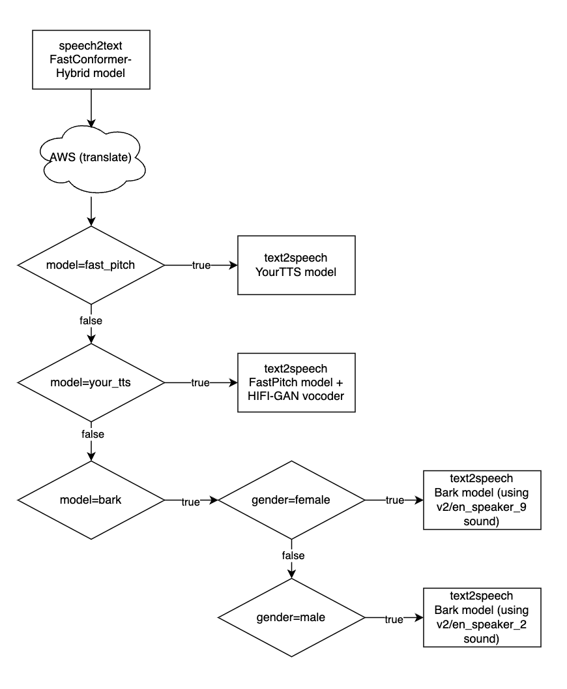

# API for AM->EN speech-to-text, text-to-speech pipeline
The backend part of this project is used to create the pipeline of the flow.
In our backend system we have a single API endpoint which accepts POST request of type form data.

## Pipeline
The pipeline consists of 3 phases:
1) **speech-to-text**: this phase is responsible for converting the wav audio file which contains Armenian speech to a text in Armenian, by using *FastConformer-Hybrid model from NVIDIA Nemo*.
2) **text-to-text (translation)**: this phase is responsible for translating the Armenian text in English by using *Amazon Translate* which is a third party service by Amazon Web Service (AWS) providing APIs translation.
3) **text-to-speech**: this phase is responsible for converting the translated English text into speech, i.e. a wav audio file, by using one of the following 3 models: *NVIDIA Nemo’s FastPitch* model to generate mel spectrograms and *HiFi-GAN* as the vocoder to synthesize natural-sounding English speech, or *YourTTS* model to return the translated speech with the user's sound, or *Bark* model to select between male or female sounds which are a bit realistic than others but its slow.



## How to run the backend
First of all you need to have python version 3.10.13 and AWS account set up in your local CLI (if you do not have any account please check the **AWS Guide** section down below).
1) `python -m venv my_venv`
2) `source my_venv/bin/activate`
3) `install_required_packages.sh` (requirements.txt file is not used to avoid package version conflicts such as `ERROR: Cannot install -r requirements.txt (line 67) and networkx==3.3 because these package versions have conflicting dependencies.`)
4) `python run.py`
NOTE: to close venv please type `deactivate` in your command line

To test you can send the following test example:

[input_speech_example_for_readme.webm](https://github.com/user-attachments/assets/c1347cc7-8f5f-4c81-b71c-c8f49b883a5f)

```sh
curl -X POST "http://localhost:8080/translations/audio?model=fast_pitch" \
  -H "accept: application/json" \
  -H "Content-Type: multipart/form-data" \
  -F "arm_speech=@resources/test/common_voice_hy-AM_41864771.wav;type=audio/wav"; open output.wav
```
This is the expected output of **Fast Pitch** model

[fast_pitch_output.webm](https://github.com/user-attachments/assets/147a7180-1814-4998-9296-736f5aad6b41)

```sh
curl -X POST "http://localhost:8080/translations/audio?model=your_tts" \
  -H "accept: application/json" \
  -H "Content-Type: multipart/form-data" \
  -F "arm_speech=@resources/test/common_voice_hy-AM_41864771.wav;type=audio/wav"; open output.wav
```
This is the expected output of **Your TTS** model

[your_tts_output.webm](https://github.com/user-attachments/assets/4039cfa1-8ec3-4d74-a9e4-a1647e93f83d)

```sh
curl -X POST "http://localhost:8080/translations/audio?model=bark&gender=male" \
  -H "accept: application/json" \
  -H "Content-Type: multipart/form-data" \
  -F "arm_speech=@resources/test/common_voice_hy-AM_41864771.wav;type=audio/wav"; open output.wav
```
This is the expected output of **Bark** model using *female* sound

[bark_female_output.webm](https://github.com/user-attachments/assets/397a8e44-09c0-40a3-a2d8-25d5bc5cf221)

```sh
curl -X POST "http://localhost:8080/translations/audio?model=bark&gender=female" \
  -H "accept: application/json" \
  -H "Content-Type: multipart/form-data" \
  -F "arm_speech=@resources/test/common_voice_hy-AM_41864771.wav;type=audio/wav"; open output.wav
```
This is the expected output of **Bark** model using *male* sound

[bark_male_output.webm](https://github.com/user-attachments/assets/21cb9aa8-76fd-476a-8148-3d319435672a)

## AWS Guide
-   Sign up or log in at [https://aws.amazon.com (https://aws.amazon.com).   
-   Navigate to **IAM (Identity and Access Management)** and create a user with programmatic access.
-   Attach the policy: `AmazonTranslateFullAccess`.
- Create a file at `~/.aws/credentials` (Linux/macOS) or `C:\Users\USERNAME\.aws\credentials` (Windows):
> [default]
aws_access_key_id = YOUR_ACCESS_KEY
aws_secret_access_key = YOUR_SECRET_KEY
region = us-east-1
